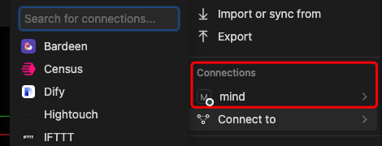
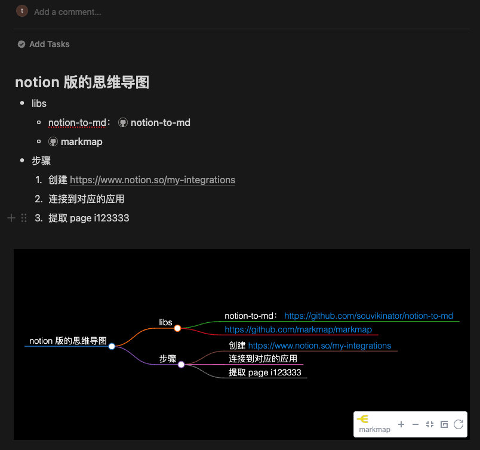

# notion mind

1. synchronize with your notion.
2. notion doc -> md -> `mind html`
3. custom mindmap in notion 

## example:

- demo-page: https://notion-mind.vercel.app/markmap/820876eb920748f2abe4ba19cee6249e
- demo-notion: https://theone1006.notion.site/notion-mind-820876eb920748f2abe4ba19cee6249e

## Deploy

[](https://vercel.com/new/clone?repository-url=https%3A%2F%2Fgithub.com%2FTheOne1006%2Fnotion-mind&env=NOTION_TOKEN&env=CACHE_FILE_DIR&env=CACHE_FILE_DIVISION&env=CACHE_DURATION&project-name=notion-mind&repository-name=notion-mind)

on server:

```bash
cp .env.example .env
# edit .env
yarn start
```

## usage

1. select page to you integrations
   - [create your integrations](https://www.notion.so/my-integrations)
   - ⭐️Tips: Automatically allow all children page 
   -  
2. copy page id
   - example: https://www.notion.so/theone1006/notion-mind-820876eb920748f2abe4ba19cee6249e?pvs=4
     - id is `820876eb920748f2abe4ba19cee6249e`
   - 
3. create link
   - mind page: `<you site url>/markmap/<page id>`
     - you can disable cache with query `?disableCache=true`
   - api: `<you site url>/api/page2md?pageId=<page id>`

## Env

```bash
# notion Integration Secret
NOTION_TOKEN=xx
# cache dir
CACHE_FILE_DIR='cache/dir'
# file top division
CACHE_FILE_DIVISION="----##==========-----info-----==========##----"
# cache enable 1 hour
CACHE_DURATION=36000000
```

## Cache File

`examples.md`

```markdown
----##==========-----info-----==========##----
expired: 1709084988674
timestamp: 1709048988674
----##==========-----info-----==========##----

# demo

- this is a demo page

```


## Getting Started

run the development server:

```bash
npm run dev
# or
yarn dev
# or
pnpm dev
# or
bun dev
```

## Base On

- https://github.com/souvikinator/notion-to-md
- https://github.com/markmap/markmap

## Create Notion Token

1. https://www.notion.so/my-integrations
2. create integrations


## example in notion


