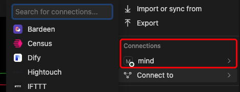
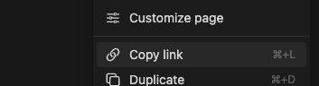
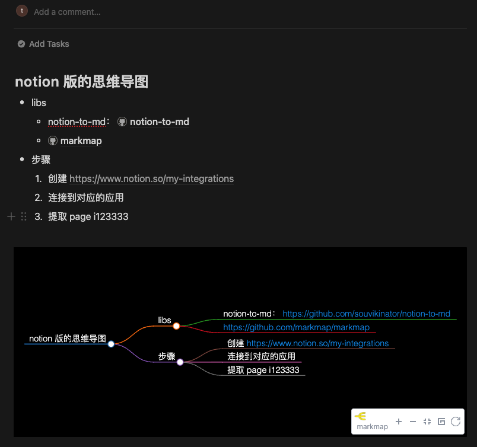

# Notion 转成思维导图

1. 与你的 Notion 同步
2. Notion 文档 -> markdown -> `思维导图 HTML`
3. 在 Notion 中自定义思维导图


## 示例:

- 演示页面: https://notion-mind.vercel.app/markmap/820876eb920748f2abe4ba19cee6249e
- Notion 演示: https://theone1006.notion.site/notion-mind-820876eb920748f2abe4ba19cee6249e

## 部署

[](https://vercel.com/new/clone?repository-url=https%3A%2F%2Fgithub.com%2FTheOne1006%2Fnotion-mind&env=NOTION_TOKEN&env=CACHE_FILE_DIR&env=CACHE_FILE_DIVISION&env=CACHE_DURATION&project-name=notion-mind&repository-name=notion-mind)

在服务器上部署:

```bash
cp .env.example .env
# edit .env
yarn start
```

## 使用方法

简单三步，即可使用:

1. 选择 Notion 页面到你的 integrations
   - [创建你的 integrations](https://www.notion.so/my-integrations)
   - ⭐️Tips: 自动允许所有子页面
   -  
2. 复制 Notion 页面的 id
   - 示例: https://www.notion.so/theone1006/notion-mind-820876eb920748f2abe4ba19cee6249e?pvs=4
     - id 是 `820876eb920748f2abe4ba19cee6249e`
   - 
3. 创建链接
   - 思维导图页面: `<you site url>/markmap/<page id>`
     - 默认有缓存，你可以通过查询参数 `?disableCache=true` 禁用缓存

## 环境变量

```bash
# notion Integration 密钥
NOTION_TOKEN=xx
# 缓存目录
CACHE_FILE_DIR='cache/dir'
# 文件顶部分隔符，用于缓存标记
CACHE_FILE_DIVISION="----##==========-----info-----==========##----"
# 缓存启用时间 1 小时
CACHE_DURATION=36000000
```

## 缓存文件

缓存文件格式:

```markdown
----##==========-----info-----==========##----
expired: 1709084988674
timestamp: 1709048988674
----##==========-----info-----==========##----

# demo

- this is a demo page

```


## 开始使用

启动开发环境:

```bash
npm run dev
# or
yarn dev
# or
pnpm dev
# or
bun dev
```

## 基于

- https://github.com/souvikinator/notion-to-md
- https://github.com/markmap/markmap

## 创建 Notion Token 步骤

1. https://www.notion.so/my-integrations
2. create integrations


## 示例


